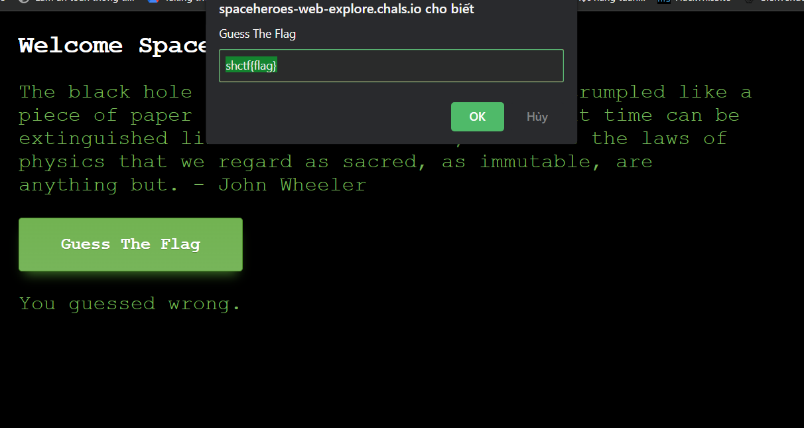
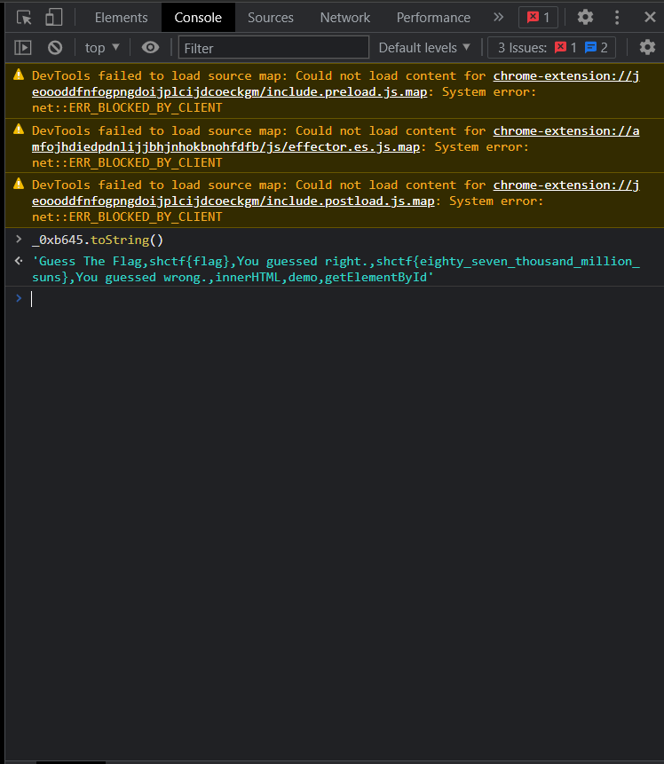
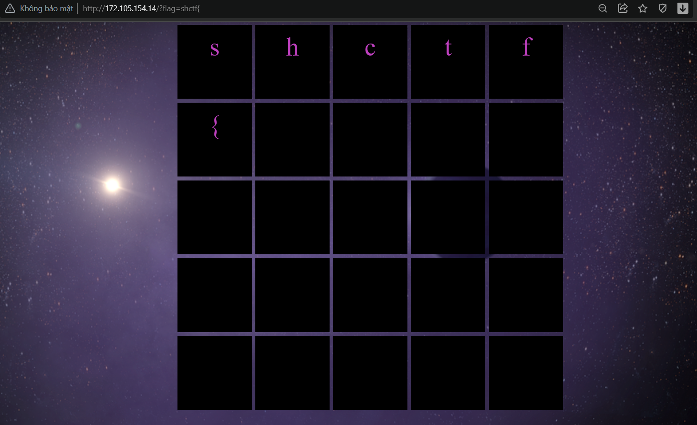

# R2D2

<h3>Description:We wouldn't miss the opportunity to make this dad joke.</h3><br>
<a href="https://spaceheroes-web-r2d2.chals.io">Link challenge</a><br>
Ngay ở tên challenge là R2D2 và challenge này là mức độ dễ ta đã có thể đoán là chall có thể liên quan đến file robots.txt.<br>
Thử truy cập vào file robots.txt thì ra flag luôn.
<code>Flag: shctf{th1s-aster0id-1$-n0t-3ntir3ly-stable}.</code>

# Space Traveler
<h3>Description: Explore space with us.</h3><br>
<a href="https://spaceheroes-web-explore.chals.io/">Link challenge</a><br>
Mới vài ta sẽ thấy site chỉ có một button <code>Guess The Flag</code>, bấm vào thì site hiện một popup như sau:<br>
</img><br>
=> Chall sẽ liên quan đến js. Check source thì có một đoạn script như sau:<code>var _0xb645=["\x47\x75\x65\x73\x73\x20\x54\x68\x65\x20\x46\x6C\x61\x67","\x73\x68\x63\x74\x66\x7B\x66\x6C\x61\x67\x7D","\x59\x6F\x75\x20\x67\x75\x65\x73\x73\x65\x64\x20\x72\x69\x67\x68\x74\x2E","\x73\x68\x63\x74\x66\x7B\x65\x69\x67\x68\x74\x79\x5F\x73\x65\x76\x65\x6E\x5F\x74\x68\x6F\x75\x73\x61\x6E\x64\x5F\x6D\x69\x6C\x6C\x69\x6F\x6E\x5F\x73\x75\x6E\x73\x7D","\x59\x6F\x75\x20\x67\x75\x65\x73\x73\x65\x64\x20\x77\x72\x6F\x6E\x67\x2E","\x69\x6E\x6E\x65\x72\x48\x54\x4D\x4C","\x64\x65\x6D\x6F","\x67\x65\x74\x45\x6C\x65\x6D\x65\x6E\x74\x42\x79\x49\x64"];function myFunction(){let _0xb729x2;let _0xb729x3=prompt(_0xb645[0],_0xb645[1]);switch(_0xb729x3){case _0xb645[3]:_0xb729x2= _0xb645[2];break;default:_0xb729x2= _0xb645[4]};document[_0xb645[7]](_0xb645[6])[_0xb645[5]]= _0xb729x2}
</code>. Ta thấy đoạn script này đã bị obfuscated . Chỗ này nhờ đã tham khảo một bài writeup của bro <a href="https://github.com/5h4s1">5h4s1</a> nên mình biết là cần dùng hàm toString() để deobfuscated. Vào console cho chạy hàm toString() với biến _0xb645 sẽ được flag.<br>
</img><br>
<code>Flag:shctf{eighty_seven_thousand_million_suns}</code><br>

# Flag in Space

<h3>Description: “The exploration of space will go ahead, whether we join in it or not.” - John F. Kennedy.</h3><br>
<a href="http://172.105.154.14/?flag=">Link challenge</a><br>
Khi truy cập vào chall, ta sẽ thấy 1 website có 1 đống ô màu đen giữa site. Nhìn vào url ta có thể thấy phương thức có 1 tham số là flag. Nhập vừa các kí tự vào, ta sẽ thấy một vài ô sẽ hiện ra chữ mà ta đã nhập vào. Thử nhập bằng form của flag: <Code>shctf{</Code> ta được:
</img>
=> nếu nhập đúng chữ cái ở vị trí tương ứng trong flag thì ô màu đen có vị trí == vị trí chữ cái đã nhập sẽ hiển thị ra chữ cái đó.
Vậy thì chỉ ta sẽ sử dụng bruteforce.
Script python:
```python
import requests
import string
import re
from time import sleep

URL = 'http://172.105.154.14/?flag='
DICT = string.printable
REGEX = "<div>\n\n(.*\n)\n<\/div>"
FLAG='shctf{'
tempFlag='shctf{'

while True:
    for ch in DICT:
        print(f'\rFLAG={FLAG+str(ch)}',end='')
        r = requests.get(URL+FLAG+str(ch))
        flagre = re.findall(REGEX, r.text)
        tempFlag = ''.join([f.strip() for f in flagre[:-1]])
        if tempFlag == FLAG+str(ch):
            FLAG += str(ch)
            print(f"\rFLAG={FLAG}",end='')
            break
```
<br>
<code>Flag: shctf{2_explor3_fronti3r}</code>
